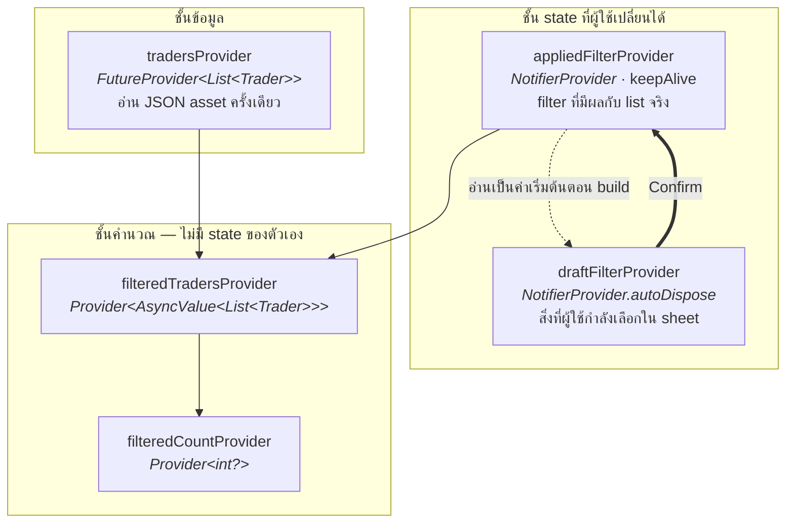
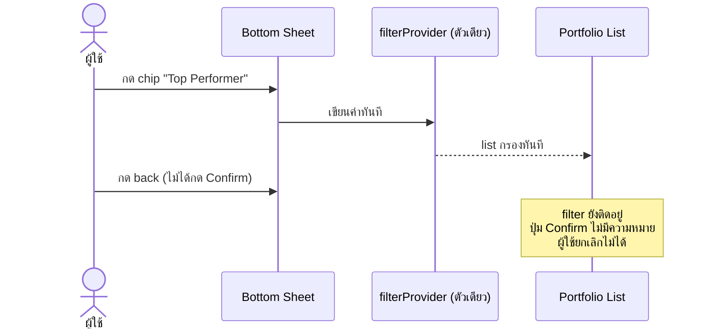
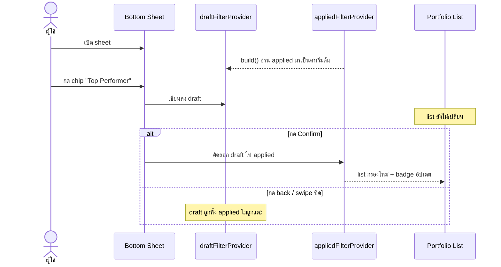
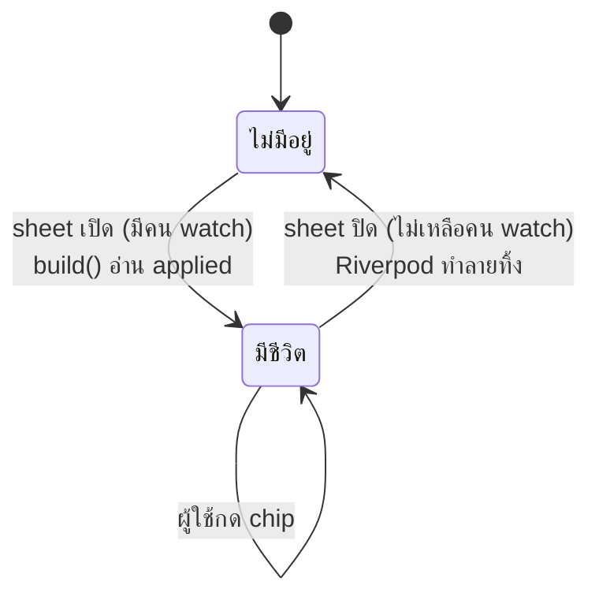

# 01 — Provider Design ⭐

> ตอบความคาดหวังของโจทย์ข้อ 1, 2 และ 3
> เป็นไฟล์ที่สำคัญที่สุดของเอกสารชุดนี้ เพราะ 3 ใน 5 ข้อที่โจทย์ระบุว่าคาดหวัง เป็นเรื่อง provider

## ภาพรวม — provider 5 ตัว



| provider | ชนิด | อายุ | หน้าที่ | ใครใช้ |
|---|---|---|---|---|
| `tradersProvider` | `FutureProvider<List<Trader>>` | ตลอดอายุแอป | อ่านและ parse JSON asset | `filteredTradersProvider` |
| `appliedFilterProvider` | `NotifierProvider<_, FilterState>` | **keepAlive** | filter ที่มีผลกับ list | หน้า list · `draftFilterProvider` |
| `draftFilterProvider` | `NotifierProvider.autoDispose<_, FilterState>` | **เท่ากับอายุของ sheet** | สิ่งที่ผู้ใช้กำลังเลือกอยู่ | bottom sheet เท่านั้น |
| `filteredTradersProvider` | `Provider<AsyncValue<List<Trader>>>` | derived | กรอง trader ตาม applied | หน้า list |
| `filteredCountProvider` | `Provider<int?>` | derived | นับผลลัพธ์สำหรับ badge | badge บนไอคอน filter |

## ทำไมต้องแยก draft ออกจาก applied

โจทย์กำหนดให้ปุ่ม `Confirm` ทำหน้าที่ *"apply filter แล้วปิด bottom sheet"* — คำว่า **apply** บอกเป็นนัยว่ามีช่วงเวลาที่ผู้ใช้เลือก chip ไปแล้วแต่ยังไม่มีผล

ถ้ามี provider เดียวแล้วให้ chip เขียนลงไปตรงๆ จะเกิดปัญหานี้



ทางแก้ที่ง่ายที่สุดคือเก็บค่าที่กำลังเลือกไว้ใน `StatefulWidget` ของ sheet — **แต่ทำไม่ได้** เพราะโจทย์บังคับว่า sheet ต้องอ่านและเขียน filter ผ่าน global provider เท่านั้น

จึงต้องแยกเป็นสอง provider โดยที่ **ทั้งคู่ยังเป็น global provider**



- `Confirm` = คัดลอก draft ไป applied แล้วปิด sheet
- `Reset` = ล้าง draft กลับค่าเริ่มต้น (ยังไม่กระทบ list จนกว่าจะกด Confirm)
- ปิดโดยไม่ Confirm = draft ถูกทิ้ง applied ไม่เปลี่ยน

## อายุของ draft — ทำไมใช้ `autoDispose` แทนการเขียน sync เอง

การแยก draft ออกมาสร้างรอยรั่วใหม่: ถ้า draft อยู่ยาว มันจะค้างค่าจากรอบที่ผู้ใช้ยกเลิกไป

```
เปิด sheet → เลือก "Top Performer" → กด back
              applied = ว่าง (ถูกต้อง)      draft = {Top Performer} (ค้าง)

เปิด sheet อีกครั้ง → เห็น chip ติ๊กค้าง ทั้งที่ list ข้างหลังไม่ได้กรอง
```

ต้องมีจังหวะที่ draft ถูกรีเซ็ตให้เท่ากับ applied — คำถามคือ **ใครทำ และทำตอนไหน**

เราเลือกไม่เขียนโค้ด sync เลย แต่ให้ Riverpod จัดการผ่าน `autoDispose`

```dart
class DraftFilterNotifier extends AutoDisposeNotifier<FilterState> {
  @override
  FilterState build() => ref.read(appliedFilterProvider);   // ค่าเริ่มต้น = ค่าที่ apply อยู่
}
```

`autoDispose` หมายความว่าเมื่อไม่เหลือ widget ใด `watch` provider ตัวนั้นอีก Riverpod จะทำลายมันทิ้ง และครั้งถัดไปที่มีคน `watch` จะเรียก `build()` ใหม่ตั้งแต่ต้น



**ผลที่ได้** — การ sync เกิดขึ้นเองโดยไม่ต้องเขียนโค้ดสักบรรทัด ไม่มี `initState` ไม่มีเมธอด `syncFromApplied()` ที่อาจลืมเรียก

**เหตุผลที่เลือกวิธีนี้**

1. **ลบทั้งคลาสของบั๊ก** — บั๊ก "ลืม sync" เกิดไม่ได้เลย เพราะไม่มีขั้นตอนให้ลืม เทียบกับการเรียก sync เองที่ต้องจำให้ครบทุกทางที่เปิด sheet ได้
2. **อายุของ state ตรงกับอายุของ UI** — draft เป็นของ sheet เมื่อ sheet ตาย draft ก็ควรตาย เป็นการใช้ lifetime ของ provider สื่อความหมาย
3. **ความต่างสองบรรทัดนี้เล่าสถาปัตยกรรมทั้งหมด** — `keepAlive` บอกว่า "นี่คือ state ของแอป" ส่วน `autoDispose` บอกว่า "นี่คือ state ชั่วคราวของหน้าจอ"

### ⚠️ กฎที่ต้องรักษา

**หน้า Portfolio List ห้าม `watch(draftFilterProvider)`**

ถ้าหน้า list เผลอ watch draft จะมีคน watch ตลอดเวลา ⇒ `autoDispose` ไม่มีวันทำงาน ⇒ draft ค้างค่าเหมือนเดิม
ตามการออกแบบ หน้า list ควรสนใจแค่ `filteredTradersProvider` กับ `filteredCountProvider` ซึ่งอ้างถึง applied เท่านั้นอยู่แล้ว

## ชั้นคำนวณ — ทำไมเป็น `Provider` ไม่ใช่ `FutureProvider`

เพราะ `tradersProvider` เป็น async ทุกอย่างที่ derive ต่อจากมันจะติด `AsyncValue` ไปด้วย คำถามคือจะจัดการอย่างไร

```dart
final filteredTradersProvider = Provider<AsyncValue<List<Trader>>>((ref) {
  final filter = ref.watch(appliedFilterProvider);          // sync
  return ref.watch(tradersProvider).whenData(               // ไม่มี await
    (all) => all.where((t) => filter.matches(t)).toList(),
  );
});

final filteredCountProvider = Provider<int?>((ref) =>
    ref.watch(filteredTradersProvider).valueOrNull?.length);
```

`whenData` แปลว่า *"ถ้ากล่องเป็น data ให้แปลงค่าข้างใน ถ้าเป็น loading หรือ error ให้ส่งต่อไปเฉยๆ"*

```
AsyncData([18 คน])  ──whenData(กรอง)──▶  AsyncData([7 คน])
AsyncLoading()      ──whenData(กรอง)──▶  AsyncLoading()      ไม่ถูกแตะ
AsyncError(e)       ──whenData(กรอง)──▶  AsyncError(e)       ไม่ถูกแตะ
```

**ถ้าเขียนเป็น `FutureProvider` แทนจะเกิดอะไร**

```dart
// แบบที่ไม่เลือก
final filteredTradersProvider = FutureProvider<List<Trader>>((ref) async {
  final filter = ref.watch(appliedFilterProvider);
  final all = await ref.watch(tradersProvider.future);
  return all.where((t) => filter.matches(t)).toList();
});
```

provider ตัวนี้ประกาศตัวเองว่าเป็นงาน async ⇒ **ทุกครั้งที่ `appliedFilter` เปลี่ยน มันจะรีเซ็ตกลับเป็น `AsyncLoading` ก่อน** แล้วค่อยกลับมาเป็น `AsyncData`

ผลที่ผู้ใช้เห็นคือ **กด Confirm แล้วหน้าจอกระพริบเป็น spinner** ทั้งที่ไฟล์อ่านเสร็จไปนานแล้ว ไม่มีอะไรต้องรอ

หลักที่ถอดได้: **async ควรมีเส้นแบ่งจุดเดียวและอยู่ล่างสุด ที่เหลือเป็นการคำนวณล้วน** ทำให้ชั้น derive ทดสอบได้แบบ sync โดยไม่ต้อง mock ไฟล์ และ UI ไม่กระพริบ

## รูปทรงของ FilterState

```dart
class FilterState {
  const FilterState({this.tags = const {}});
  final Set<String> tags;

  bool get isEmpty => tags.isEmpty;
  bool matches(Trader t) => tags.isEmpty || t.tags.any(tags.contains);   // OR

  FilterState copyWith({Set<String>? tags}) => FilterState(tags: tags ?? this.tags);
}
```

**ทำไมเป็น class ไม่ใช่ `Set<String>` เปล่าๆ**

ดีไซน์ใน Figma มี filter อีก 4 กลุ่ม (Smart Copy, ช่วง PnL, ROI ขั้นต่ำ, ช่วงเวลา) ที่โจทย์รอบนี้ตัดออก การห่อไว้เป็น class ตั้งแต่แรกทำให้เพิ่ม field ทีหลังได้โดย **ไม่ต้องแก้ signature ของ provider ทั้งสองตัวและ widget ที่ใช้อยู่**

ถ้าใช้ `Set<String>` ตรงๆ วันที่เพิ่มเงื่อนไขที่สอง จะต้องรื้อทั้ง `appliedFilterProvider`, `draftFilterProvider`, `filteredTradersProvider` และทุก widget ที่อ้างถึง

**ทำไม `matches` อยู่ใน FilterState ไม่ใช่ใน widget**

โจทย์ระบุว่า *"ไม่ควรเขียน logic กรองปนอยู่ใน widget"* การวางตรรกะไว้ใน domain object ทำให้เขียน unit test ได้โดยไม่ต้องสร้าง widget และไม่ต้องมี `ProviderContainer`

## เหตุผลที่เลือก pattern นี้

### เลือก `Notifier` ไม่ใช่ `StateNotifier` หรือ `AsyncNotifier`

| pattern | ทำไมไม่เลือก |
|---|---|
| `StateNotifier` | เป็น legacy ใน Riverpod 2.x และถูกลบออกจาก surface ที่แนะนำใน 3.x โปรเจกต์นี้ตั้งใจอยู่ที่ 2.6.1 เพราะการ migrate ไป 3.x จะเปลี่ยน API ของ `AutoDisposeNotifier` ที่ `draftFilterProvider` ใช้อยู่ ซึ่งไม่คุ้มค่าในการทำภายใน assessment |
| `AsyncNotifier` | filter state ไม่มีงาน async — การใช้จะบังคับให้ทุกที่ต้อง unwrap `AsyncValue` โดยไม่ได้อะไรกลับมา |
| `StateProvider` | เขียนสั้นกว่าก็จริง แต่ไม่มีที่ให้วางเมธอด `toggle` / `reset` / `applyFrom` ทำให้ตรรกะไปกระจายอยู่ใน widget ซึ่งขัดกับที่โจทย์ขอ |

`Notifier` ให้ทั้งความเรียบง่ายและที่ทางสำหรับเมธอด — ตรงกับลักษณะของงานพอดี

### เขียนด้วยมือ ไม่ใช้ codegen

โจทย์ยกตัวอย่าง `@Riverpod(keepAlive: true)` แต่เขียนต่อว่า *"หรือ pattern ที่เทียบเท่า"*

annotation ตัวนั้นไม่ได้ทำอะไรพิเศษ — `build_runner` จะ generate ไฟล์ที่มีบรรทัดนี้ออกมาให้

```dart
final appliedFilterProvider = NotifierProvider<AppliedFilter, FilterState>(...);
```

ซึ่งก็คือสิ่งที่เขียนเองได้ตรงๆ สิ่งที่โจทย์วัดจริงคือ **filter state อยู่ใน provider ระดับ global ไม่ใช่ใน widget** ซึ่งการประกาศที่ระดับ top-level ตอบได้ครบแล้ว

เหตุผลเพิ่มเติมที่เลือกเขียนมือในบริบทของงานส่ง:

- **อ่านง่ายกว่าสำหรับผู้ตรวจ** — เห็น `NotifierProvider` กับ `.autoDispose` ด้วยตา ไม่ต้องเปิดไฟล์ generated เพื่อยืนยันว่า lifetime เป็นอย่างไร ซึ่งสำคัญมากในงานนี้เพราะความต่างของ lifetime คือแก่นของการออกแบบ
- **ไม่ต้องรัน `build_runner` ก่อนเปิดโปรเจกต์** — ผู้ตรวจ clone แล้ว `flutter run` ได้ทันที
- **ไม่มีไฟล์ `.g.dart`** ให้ต้องตัดสินใจว่าจะ commit หรือ gitignore

ราคาที่จ่ายคือเสียการตรวจสอบชื่อ provider ตอน compile และมี boilerplate มากกว่าเมื่อโปรเจกต์โต — ซึ่งยอมรับได้ในขนาดงานนี้

## เช็คลิสต์เทียบกับที่โจทย์คาดหวัง

| ความคาดหวังจากโจทย์ | ตอบด้วย | ตรวจอย่างไร |
|---|---|---|
| Provider สำหรับ filter state (global, keep-alive) | `appliedFilterProvider` | เป็น `NotifierProvider` ประกาศที่ top-level และ **ไม่ใช่** `autoDispose` |
| Provider ที่ derive รายชื่อที่กรองแล้ว ไม่เขียน logic กรองใน widget | `filteredTradersProvider` + `FilterState.matches` | ค้นหา `.where(` ในชั้น presentation ต้องไม่พบ |
| Provider หรือ computed value สำหรับจำนวน trader ที่ผ่าน filter | `filteredCountProvider` | badge อ่านจาก provider ตัวนี้เท่านั้น ไม่นับเองใน widget |
