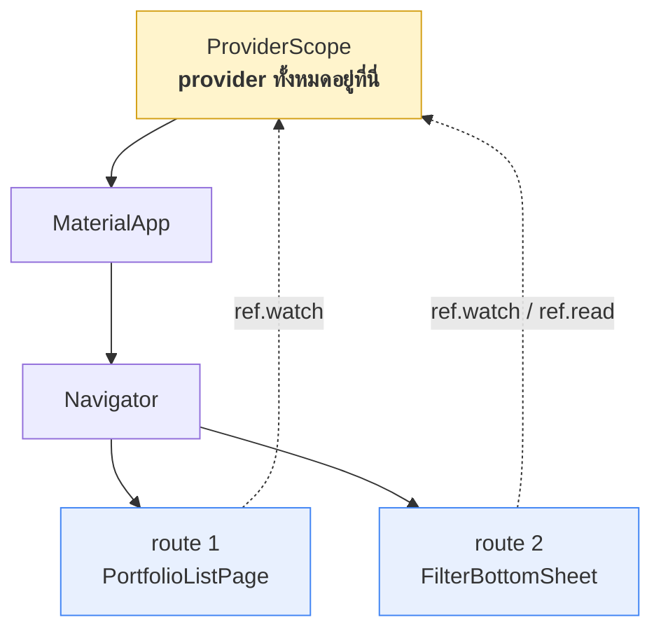

# 02 — Widget Decoupling

> ตอบความคาดหวังของโจทย์ข้อ 4 และครอบคลุมหัวข้อ **Screen / Navigation** ของกรอบวิเคราะห์

## ข้อบังคับจากโจทย์

> ห้าม pass ค่า filter state จาก Portfolio List Page ผ่าน constructor/parameter เข้าไปยัง Filter Bottom Sheet widget โดยตรง
> Bottom Sheet widget ต้องอ่านและเขียนค่า filter ผ่าน global Riverpod provider เท่านั้น

และโจทย์อธิบายเหตุผลไว้เองว่า ในงานจริง filter state มักถูกใช้จากหลายจุดในแอป การผูก state ไว้กับ widget tree ผ่าน constructor ทำให้ widget สองตัว coupling กันแน่นเกินจำเป็นและทดสอบแยกกันไม่ได้

## ทำไม bottom sheet ถึงเป็นโจทย์ที่เหมาะกับข้อบังคับนี้

`showModalBottomSheet` ไม่ได้แทรก widget ลงไปในหน้าเดิม แต่ **สร้าง route ใหม่ซ้อนขึ้นมา** — sheet จึงอยู่คนละ subtree กับหน้า list



เพราะอยู่คนละ subtree การส่งค่าผ่าน `InheritedWidget` หรือ context จึงทำไม่ได้อยู่แล้ว — ทางเดียวที่เหลือคือส่งผ่าน constructor (ซึ่งโจทย์ห้าม) หรือใช้ global provider

แต่ `ref` ไม่ไต่ตาม widget tree ของ route มันไต่ขึ้นไปหา `ProviderScope` ซึ่งอยู่ **เหนือ `MaterialApp`** ⇒ ทั้งสอง route มองเห็น provider ตัวเดียวกันเสมอ

นี่คือสถานการณ์ที่ "ส่งผ่าน constructor" ทำได้แต่ผิดหลักการ ส่วน "ใช้ global provider" เป็นคำตอบที่ถูกโดยธรรมชาติ

## Navigation

หน้าจอทั้งหมดในดีไซน์เป็น **จอเดียวขนาดโทรศัพท์ + bottom sheet หนึ่งใบ** ไม่มีหน้ารายละเอียดของ trader ไม่มี deep link

```dart
IconButton(
  onPressed: () => showModalBottomSheet(
    context: context,
    isScrollControlled: true,
    builder: (_) => const FilterBottomSheet(),
  ),
  icon: const FilterIconWithBadge(),
)
```

| ทางเลือก | ทำไมไม่เลือก |
|---|---|
| เพิ่ม `go_router` | ไม่มีอะไรให้ route — เพิ่ม dependency และไฟล์ที่ผู้ตรวจต้องอ่านโดยไม่ได้อะไรกลับมา |
| ทำ sheet เองด้วย `Stack` + `AnimatedPositioned` | ต้องเขียน barrier, drag-to-dismiss และการรับปุ่ม back เองทั้งหมด และ sheet จะอยู่ subtree เดียวกับหน้า list ซึ่ง **เพิ่มโอกาสที่จะเผลอส่ง parameter** |

`isScrollControlled: true` จำเป็นจริง เพราะ sheet ในดีไซน์สูงเกินครึ่งจอและ prototype มีขั้นตอนที่ต้องเลื่อนลงเพื่อดูหัวข้อล่างสุด

## `const` คือหลักฐานที่ตรวจได้ในบรรทัดเดียว

```dart
builder: (_) => const FilterBottomSheet(),
```

widget ที่ประกาศเป็น `const` ได้ แปลว่ามันไม่มี field ที่รับค่ามาจากภายนอกเลย — ถ้ามีเมื่อไหร่ คอมไพเลอร์จะปฏิเสธทันที

```dart
// ถ้าเผลอเขียนแบบนี้ จะ compile ไม่ผ่านที่จุดเรียกใช้
class FilterBottomSheet extends ConsumerWidget {
  const FilterBottomSheet({super.key, required this.selectedTags});
  final Set<String> selectedTags;                  // ← const ที่ call site พังทันที
}
```

เท่ากับว่า **ข้อบังคับของโจทย์ถูกบังคับใช้โดย type system ไม่ใช่โดยวินัยของคนเขียน** ผู้ตรวจไม่ต้องไล่อ่านโค้ดทั้งไฟล์เพื่อยืนยัน แค่ดูบรรทัดที่เปิด sheet ก็พอ

## ภายใน sheet อ่านและเขียนอย่างไร

```dart
class FilterBottomSheet extends ConsumerWidget {
  const FilterBottomSheet({super.key});

  @override
  Widget build(BuildContext context, WidgetRef ref) {
    final draft = ref.watch(draftFilterProvider);              // อ่านจาก provider

    return Column(
      children: [
        for (final tag in kAllTags)
          TagChip(
            label: tag,
            selected: draft.tags.contains(tag),
            onTap: () => ref.read(draftFilterProvider.notifier).toggle(tag),
          ),
        Row(children: [
          OutlinedButton(
            onPressed: () => ref.read(draftFilterProvider.notifier).reset(),
            child: const Text('Reset'),
          ),
          FilledButton(
            onPressed: () {
              ref.read(appliedFilterProvider.notifier).applyFrom(ref.read(draftFilterProvider));
              Navigator.pop(context);
            },
            child: const Text('Confirm'),
          ),
        ]),
      ],
    );
  }
}
```

จุดที่ต้องสังเกต:

- ไม่มี parameter ใดที่เกี่ยวกับ filter เข้ามาทาง constructor
- `ref.watch` ใช้ใน `build` เพื่อให้ rebuild เมื่อ draft เปลี่ยน · `ref.read` ใช้ใน callback เพราะไม่ต้องติดตามต่อ
- sheet ไม่รู้จัก `PortfolioListPage` และหน้า list ก็ไม่รู้จัก `FilterBottomSheet` นอกจากบรรทัดที่เปิดมัน

## ผลพลอยได้ — ทดสอบแยกกันได้

เพราะไม่มีการส่งค่าระหว่างกัน จึงทดสอบ sheet ได้โดยไม่ต้องสร้างหน้า list ขึ้นมาก่อน

```dart
final container = ProviderContainer();
container.read(draftFilterProvider.notifier).toggle('Top Performer');
container.read(appliedFilterProvider.notifier)
         .applyFrom(container.read(draftFilterProvider));

expect(container.read(appliedFilterProvider).tags, {'Top Performer'});
```

นี่คือประโยชน์ที่โจทย์อ้างถึงตอนอธิบายเหตุผลของข้อบังคับ — ตรรกะทั้งหมดพิสูจน์ได้โดยไม่ต้องแตะ widget เลย
