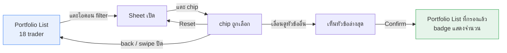
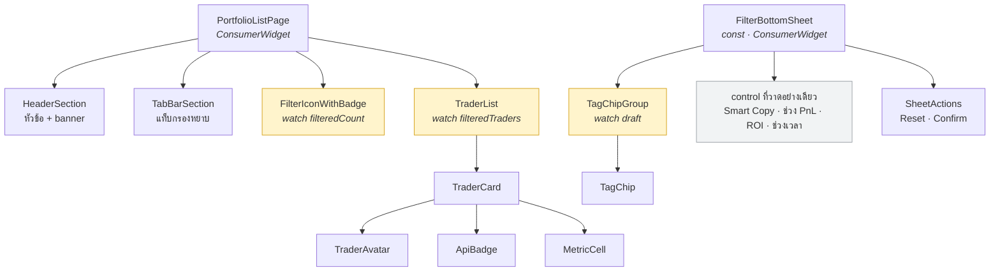

# 03 — UI และ Figma

> ตอบความคาดหวังของโจทย์ข้อ 5 (*UI ตรงกับ Figma 100%*)
> ครอบคลุมหัวข้อ **User Flow** และ **UI Components** ของกรอบวิเคราะห์

## User Flow

ดีไซน์วางไว้เป็น prototype เส้นเดียว 7 จอ ทุกจอขนาดโทรศัพท์ — แต่ในเชิงโครงสร้างคือ **หน้าเดียวกับสถานะของ bottom sheet**



เส้นทางที่ดีไซน์ **ไม่ได้วาดไว้แต่ต้องรองรับ**

| เส้นทาง | ต้องเกิดอะไร |
|---|---|
| ปิด sheet โดยไม่กด Confirm | filter ไม่เปลี่ยน · เปิดใหม่ต้องเห็นค่าที่ apply อยู่ ไม่ใช่ค่าที่เพิ่งยกเลิก |
| กด Reset แล้วปิดโดยไม่ Confirm | filter เดิมยังอยู่ — Reset ล้างแค่สิ่งที่กำลังเลือก |
| ยกเลิก chip จนไม่เหลือแล้วกด Confirm | กลับไปแสดงครบทุกคน · badge แสดงจำนวนทั้งหมด |
| เปิด sheet ระหว่างที่ข้อมูลยังโหลดไม่เสร็จ | chip ต้องกดได้ปกติ (filter ไม่ขึ้นกับข้อมูล) แต่ badge ยังไม่มีตัวเลข |

## Component Tree



| สีในแผนภาพ | หมายถึง |
|---|---|
| เหลือง | widget ที่ `watch` provider — จุดที่ UI ผูกกับ state |
| ขาว | widget ที่รับค่าผ่าน constructor ธรรมดา ไม่รู้จัก Riverpod |
| เทา | วาดตามดีไซน์แต่ยังไม่ผูก logic |

**หลักที่ใช้แบ่ง** — ให้ widget ที่ `watch` provider มีให้น้อยที่สุดและอยู่ใกล้จุดที่ใช้ค่าที่สุด เพื่อให้ขอบเขตการ rebuild แคบ เช่น `FilterIconWithBadge` watch เฉพาะ `filteredCountProvider` ไม่ใช่ list ทั้งก้อน เมื่อจำนวนเปลี่ยน จะ rebuild แค่ badge

## โครงสร้าง Trader Card

```
┌─────────────────────────────────────────────────┐
│  (avatar)  ชื่อ trader          [API]           │
│            จำนวนผู้ copy / เพดาน                 │
│                                                 │
│  30 Days PNL (USD)                              │
│  56,592.50                                      │
│  ROI                                            │
│  17.07%                                         │
│                                                 │
│  AUM           30 Days MDD      Sharpe Ratio    │
│  388,038.47    2.54%            2.15            │
│                                                 │
│  [  Mock  ]    [       Copy       ]             │
└─────────────────────────────────────────────────┘
```

ช่องขวาล่างคือจุดที่เบี่ยงจากดีไซน์ — **`Days Leading Trading` ถูกถอดออกทั้งหมด** ไม่ย้ายไปที่อื่น อธิบายเหตุผลในหัวข้อถัดไป

## จุดที่โจทย์กับดีไซน์ขัดกัน

การเทียบข้อความโจทย์กับดีไซน์และ mock data ทีละบรรทัด พบความขัดแย้ง 3 จุด ทั้งหมดต้องตัดสินใจ ไม่มีทางทำตามทั้งสองฝั่งพร้อมกันโดยไม่คิด

### ① Sharpe Ratio ไม่มีที่ยืนในดีไซน์

โจทย์บังคับว่า card ต้องแสดง Sharpe Ratio แต่ card ในดีไซน์ไม่มีช่องนี้ ในทางกลับกันดีไซน์มีหัวข้อ **Days Leading Trading** ซึ่ง **ไม่มี field รองรับใน mock data เลย**

```
ดีไซน์ต้องการ แต่ข้อมูลไม่มี  :  Days Leading Trading
ข้อมูลมี แต่ดีไซน์ไม่แสดง     :  Sharpe Ratio
                                        ↑
                              ขาดกันพอดี 1 ต่อ 1
```

**เลือก: ใช้ช่องที่สามของแถวนั้นแสดง Sharpe Ratio แทน และถอด Days Leading Trading ออกทั้งหมด**

เหตุผล — ตอบได้ทั้งสองเงื่อนไขพร้อมกัน โจทย์ได้ field ครบ ส่วนดีไซน์ยังคง layout เดิม (สามคอลัมน์ ตำแหน่งเดิม เปลี่ยนแค่ label กับค่า) และถ้าทำตามดีไซน์ตรงตัวจะไม่มีข้อมูลจะใส่ ต้อง hardcode ตัวเลขปลอม ซึ่งเป็นการเบี่ยงที่แย่กว่า

**ทำไมถึงถอดออก ไม่ย้ายไปแถวที่สี่** — การเพิ่มแถวเพื่อคง `Days Leading Trading` ไว้ ต้องเติมค่าที่ไม่มีในข้อมูล ซึ่งแปลว่าต้อง hardcode ตัวเลขเดียวกันให้ทุกการ์ด หรือสุ่มค่าขึ้นมาเอง ทั้งสองทางคือการใส่ข้อมูลปลอมลงในงานที่ส่ง และยังทำให้การ์ดสูงกว่าดีไซน์ กระทบจำนวนการ์ดที่เห็นต่อหนึ่งหน้าจอ — **ข้อมูลที่ไม่มีจริง ไม่ควรมีที่ยืนบนหน้าจอ**

หลักที่ถอดได้: **เวลาดีไซน์กับข้อมูลไม่ตรงกัน ให้เอามาทาบกันก่อนตัดสิน ส่วนที่ขาดมักบอกเจตนาที่แท้จริง**

### ② Sheet ในดีไซน์มีหัวข้อมากกว่าที่โจทย์ขอ

| ในดีไซน์ | โจทย์บอก |
|---|---|
| **Tags** — multi-select chips 7 ตัว | ต้องทำ |
| Smart Copy | ไม่ได้ขอ |
| ช่วง 30D PnL — range slider | ไม่ได้ขอ |
| 7D ROI ขั้นต่ำ — chips 4 ระดับ | ไม่ได้ขอ |
| ช่วงเวลา | ไม่ได้ขอ |
| **Reset / Confirm** | ต้องทำ |

โจทย์เขียนสองประโยคที่ตีกันเอง — *"filter รอบนี้เจตนาให้เหลือเงื่อนไขเดียว (Tags)"* กับ *"UI ตรงกับ Figma 100%"*

**เลือก: วาดครบตามดีไซน์ แต่ผูก logic เฉพาะ Tags**

เหตุผล

1. โจทย์บอกเจตนาตัวเองไว้แล้วว่าอยากดูการออกแบบ provider ไม่ใช่ความซับซ้อนของ filter logic ⇒ เวลาที่ประหยัดได้ควรลงกับ provider, test และเอกสาร
2. *"UI ตรงกับ Figma"* พูดถึงสิ่งที่ตาเห็น ไม่ได้ระบุว่าทุก control ต้องทำงาน — การวาดครบจึงตอบข้อนี้แล้ว
3. ถ้าตัดทิ้ง ผู้ตรวจเปิดดีไซน์เทียบแล้วจะแยกไม่ออกว่าเรา *เลือก* ไม่ทำ หรือ *ทำไม่ทัน*

ผลที่ตามมา: `FilterState` ถูกออกแบบเป็น class ที่มี field `tags` ตั้งแต่แรก เพื่อเพิ่มเงื่อนไขอื่นทีหลังได้โดยไม่ต้องรื้อ provider — ดู [01](01-provider-design.md#รูปทรงของ-filterstate)

### ③ Tag ที่มีในข้อมูลแต่ไม่มี chip

mock data มี tag ชื่อ `High Risk` อยู่กับ trader 2 คน แต่ดีไซน์ไม่มี chip สำหรับ tag นี้

ผลคือ **trader สองคนนั้นจะปรากฏเฉพาะตอนที่ยังไม่ได้กรอง** และทั้งคู่บังเอิญเป็นคนเดียวในชุดข้อมูลที่มี PnL, ROI และ Sharpe Ratio **ติดลบ**

**เลือก: ทำตามดีไซน์ ไม่เพิ่ม chip**

เหตุผล — โจทย์ระบุ chip ที่ต้องมีผ่านดีไซน์ การเพิ่มเองคือการแก้โจทย์ แต่ต้อง **บันทึกไว้** เพราะเป็นสิ่งที่ผู้ตรวจอาจสังเกตเห็นแล้วสงสัย

ผลข้างเคียงที่เป็นประโยชน์: trader ที่ค่าติดลบยังปรากฏในสถานะเริ่มต้น ทำให้ทดสอบการแสดงผลค่าติดลบ (สีแดง, เครื่องหมายลบ) ได้ทันทีที่เปิดแอป

## ตัวเลขในดีไซน์ไม่ใช่ spec

badge บนไอคอน filter ในดีไซน์แสดงเลข `4` แต่เมื่อตรวจสถานะของ chip ในจอก่อนหน้า พบว่ามี chip ถูกเลือกเพียงตัวเดียว และ tag นั้นมี trader อยู่ **3 คน** ในชุดข้อมูล

ทั้งการตีความแบบ OR และ AND ต่างก็ไม่ได้ผลลัพธ์เป็น 4 ⇒ **ตัวเลขบน badge เป็น placeholder ที่นักออกแบบใส่ไว้ ไม่ได้คำนวณจากข้อมูลจริง**

ข้อสรุปที่ใช้ต่อ: **ยึดข้อความในโจทย์เป็นหลัก** ซึ่งระบุว่า badge แสดง *"จำนวน trader ที่ผ่าน filter ปัจจุบัน"*

เรื่องนี้เป็นบทเรียนกว้างกว่านั้น — ค่าที่อยู่ในดีไซน์มีสองชนิดปนกันเสมอ คือ **ค่าที่เป็นข้อกำหนด** (ระยะห่าง, สี, ขนาดตัวอักษร) กับ **ค่าที่เป็นตัวอย่าง** (ตัวเลข, ชื่อ, รูป) การแยกสองอย่างนี้ไม่ออกทำให้ hardcode ค่าตัวอย่างลงโค้ดโดยไม่รู้ตัว

## สรุปสิ่งที่ต้องเขียนใน README ของโปรเจกต์

โจทย์เปิดช่องไว้แล้วในหัวข้อ *"หากมีข้อจำกัดด้านเวลาทำให้บางส่วนไม่สมบูรณ์ ให้ระบุไว้ด้วย"*

1. ช่องที่สามของ card แสดง Sharpe Ratio แทน Days Leading Trading ซึ่งถูกถอดออกทั้งหมด เพราะโจทย์บังคับ field แรกและ mock data ไม่มีข้อมูลของอันหลัง
2. control อื่นใน sheet วาดตามดีไซน์แต่ยังไม่ผูก logic เพราะโจทย์ระบุให้ filter รอบนี้มีเงื่อนไขเดียว
3. `High Risk` ไม่มี chip ตามดีไซน์ ทำให้ trader 2 คนกรองไม่ได้

การเขียนสามบรรทัดนี้เปลี่ยนสิ่งที่ดูเหมือน "ทำไม่ครบ" ให้กลายเป็น "อ่านโจทย์ละเอียดจนเห็นความขัดแย้งและตัดสินใจอย่างมีเหตุผล"
