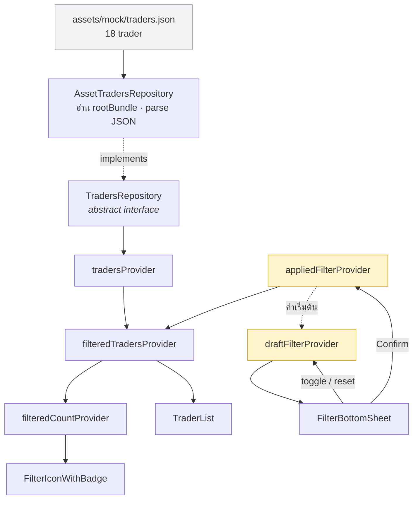
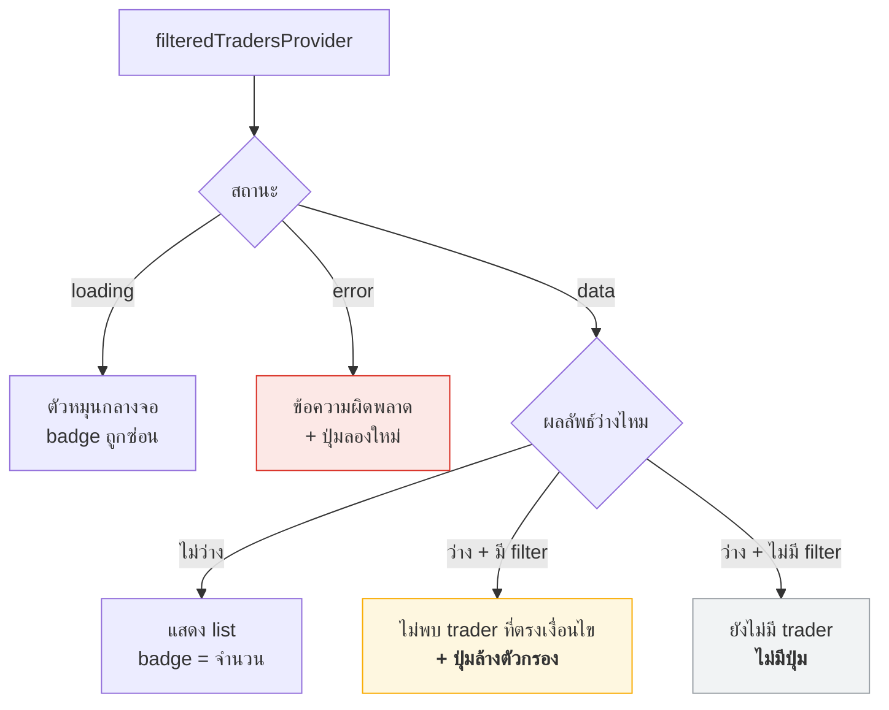

# 04 — Data และ UI States

> ครอบคลุมหัวข้อ **Data Flow**, **API Integration**, **Local Storage / Cache** และ **Error / Loading States** ของกรอบวิเคราะห์

## Data Flow

ข้อมูลไหลทางเดียวจากไฟล์ขึ้นไปหา UI ส่วนการเขียนกลับเกิดผ่าน notifier เท่านั้น ไม่มี widget ไหนแก้ข้อมูลโดยตรง



**หลักที่ใช้**

- **การอ่านไหลลง การเขียนไหลขึ้น** — widget อ่านจาก provider ที่ derive แล้ว และเขียนกลับผ่านเมธอดของ notifier เท่านั้น
- **ตรรกะการกรองไม่อยู่ใน widget** — อยู่ใน `FilterState.matches` และถูกเรียกจาก `filteredTradersProvider` ตามที่โจทย์ระบุ
- **async มีเส้นแบ่งจุดเดียว** — เฉพาะ `tradersProvider` ที่แตะ I/O ที่เหลือเป็นการคำนวณล้วน ทำให้ทดสอบได้แบบ sync

## API Integration

โจทย์ระบุชัดว่า **ไม่ต้องเรียก API จริง** ให้ใช้ mock data ในเครื่อง — ดังนั้นหัวข้อนี้ในงานนี้คือ *การเตรียมที่ทางไว้ให้ API ในอนาคต* ไม่ใช่การเรียก API

**เลือก: local JSON asset ผ่าน repository interface**

```dart
abstract interface class TradersRepository {
  Future<List<Trader>> fetchTraders();
}

class AssetTradersRepository implements TradersRepository {
  @override
  Future<List<Trader>> fetchTraders() async {
    final raw = await rootBundle.loadString('assets/mock/traders.json');
    return (jsonDecode(raw) as List).map((e) => Trader.fromJson(e)).toList();
  }
}
```

เหตุผลที่เลือก JSON asset แทนการ hardcode `List` ใน Dart

1. **โจทย์อนุญาตตรงตัว** — *"ใช้ mock data ในเครื่อง เช่น local JSON หรือ Dart list"*
2. **ได้ async boundary จริง** — ทำให้ loading และ error state เป็นของจริงที่รันได้ ไม่ใช่ข้อความในเอกสาร ถ้า hardcode เป็น `const List` หัวข้อ Error/Loading จะไม่มีอะไรให้ทำจริง
3. **ได้ชั้น parsing จริง** — มี `fromJson` ที่พังได้ถ้าข้อมูลผิดรูป ซึ่งเป็นสิ่งที่ต้องเจอเมื่อต่อ API จริง

เหตุผลที่ห่อด้วย interface ทั้งที่มี implementation เดียว — วันที่เปลี่ยนไปเรียก REST จริง จะแก้แค่ class เดียว **โดยไม่ต้องแตะ provider ชั้นบนหรือ widget เลย** เพราะทุกอย่างเหนือ `tradersProvider` มองเห็นแค่ `Future<List<Trader>>`

## Local Storage / Cache

หัวข้อนี้เป็นกับดักของกรอบวิเคราะห์ — การมีหัวข้ออยู่ทำให้อยากใส่ของลงไปให้ครบช่อง ทั้งที่งานนี้มีของจริงไม่ครบทุกแบบ

| จุด | มีของจริงไหม | สรุป |
|---|---|---|
| การอ่าน JSON asset | มี | `tradersProvider` มีอายุตลอดแอป จึงอ่านไฟล์ **ครั้งเดียว** — ได้มาโดยไม่ต้องเขียนอะไร แต่ควรรู้ตัวว่าได้อะไร |
| รูป avatar | มี | เป็น URL จริง Flutter มี `ImageCache` ในตัวอยู่แล้ว |
| filter ข้ามการปิดแอป | **ไม่ทำ** | เหตุผลด้านล่าง |

**เลือก: ไม่เก็บ filter ลง disk**

1. **โจทย์ไม่ได้ขอ และเจตนาของข้อบังคับเป็นคนละเรื่อง** — โจทย์อธิบายว่า *"filter state มักถูกใช้จากหลายจุดในแอป"* นั่นคือปัญหาเรื่อง **ขอบเขตการเข้าถึง** ไม่ใช่ **อายุการเก็บ** ซึ่ง global provider ตอบครบแล้ว
2. **ต้นทุนแฝงสูงกว่าที่เห็น** — การอ่านค่าจาก storage เป็นงาน async ⇒ `appliedFilterProvider` ที่ตอนนี้เป็น sync จะติด `AsyncValue` ตามไปทั้งสาย ⇒ ต้องรื้อการออกแบบใน [01](01-provider-design.md) ทั้งหมด เพื่อแลกกับความสามารถที่ไม่มีใครขอ

**หลักที่ถอดได้** — การตัดสินใจ "ไม่ทำ" ที่มีเหตุผลรองรับ คือคำตอบที่สมบูรณ์ของหัวข้อ ไม่จำเป็นต้องยัด dependency เข้ามาให้ทุกช่องมีของ

## ความหมายของการเลือกหลาย tag

โจทย์ระบุแค่ว่า chip เลือกได้มากกว่า 1 ไม่ได้บอกว่าเลือกสองอันแล้วหมายถึงอะไร

- **OR** — เอา trader ที่มี tag ใด tag หนึ่ง ⇒ ยิ่งเลือกยิ่งได้เยอะ
- **AND** — เอา trader ที่มีครบทุก tag ⇒ ยิ่งเลือกยิ่งเหลือน้อย

**เลือก: OR**

การตัดสินใจนี้ทำโดยคำนวณผลลัพธ์จากชุดข้อมูลจริงทุกความเป็นไปได้ ไม่ใช่จากความรู้สึก

| จำนวน chip ที่เลือก | ผลแบบ AND | ผลแบบ OR |
|---|---|---|
| 2 chips (21 ชุด) | **11 ชุดได้ 0 คน** · มากที่สุดคือ 2 คน | ทุกชุดได้ 5–9 คน |
| 3 chips (35 ชุด) | **34 ชุดได้ 0 คน** เหลือชุดเดียวที่ได้ 1 คน | ทุกชุดได้ 7–12 คน |
| 4 chips ขึ้นไป | **ได้ 0 คนทุกชุด** — ไม่มี trader คนใดมีเกิน 3 tag | — |

ข้อโต้แย้งที่หนักแน่นฝั่ง AND คือพฤติกรรมจริงของนักลงทุนที่กดหลาย filter เพื่อ *จำกัดกรอบ* หา trader ที่เข้าเกณฑ์ครบ — ซึ่งถูกต้อง แต่ถูกคนละชั้น

ในระบบ filter จริง การจำกัดกรอบเกิดจาก **AND ระหว่างกลุ่ม** ไม่ใช่ภายในกลุ่มเดียวกัน

```
กลุ่ม Tags     :  Top Performer  OR  Money Maker      ← OR ภายในกลุ่ม
     AND
กลุ่ม ROI      :  ตั้งแต่ 25% ขึ้นไป                    ← AND ข้ามกลุ่ม
     AND
กลุ่ม PnL      :  ตั้งแต่ 100,000 ขึ้นไป
```

ดีไซน์วาง filter ไว้ 5 กลุ่มพอดีตามรูปแบบนี้ แต่โจทย์ตัดเหลือกลุ่มเดียว ⇒ ตัว AND ระหว่างกลุ่มหายไปเอง เหลือแค่ OR ภายในกลุ่ม

เหตุผลชี้ขาดคือ **ชุดข้อมูลที่โจทย์ให้มาเองรองรับ AND ไม่ไหว** — ถ้าตั้งใจให้เป็น AND จะต้องออกแบบให้ tag ซ้อนทับกันมากกว่านี้มาก

**ราคาที่จ่าย** — tag ที่มี trader น้อยที่สุดมีอยู่ 3 คน ดังนั้นแบบ OR ผลลัพธ์จะไม่ต่ำกว่า 3 เสมอ ⇒ **สถานะ "กรองแล้วไม่พบ" กดยังไงก็ไม่เจอ** ซึ่งนำไปสู่หัวข้อถัดไป

## Error / Loading / Empty States

ไล่ทุกทางที่ UI ไปได้ แล้วแยกว่าอันไหนเจอได้จริง

| สถานะ | เจอได้จริงไหม | ทางที่จะเจอ |
|---|---|---|
| กำลังโหลด | แว่บเดียว | อ่าน asset เร็วมาก อาจไม่ทันเห็น |
| โหลดผิดพลาด | **เจอได้จริง** | ลืมประกาศ asset ใน pubspec · JSON ผิดรูป · field หาย |
| กรองแล้วไม่พบ | **กดไม่เจอ** | เพราะเลือก OR |
| ไม่มีข้อมูลเลย | กดไม่เจอ | ไฟล์มี 18 คนเสมอ |
| รูป avatar โหลดไม่ขึ้น | **เจอง่ายมาก** | รันแบบไม่มีเน็ต → พร้อมกัน 18 ใบ |
| badge ตอนยังไม่มีข้อมูล | เจอได้ | ช่วงที่ยังโหลดไม่เสร็จ |



### ทำไมต้องแยก empty เป็นสองแบบ

เพราะ **ทางออกของผู้ใช้ต่างกัน**

- **กรองแล้วไม่พบ** — ผู้ใช้แก้ได้เอง จึงต้องมีปุ่มล้างตัวกรองให้กดกลับได้ทันที
- **ไม่มีข้อมูลเลย** — ผู้ใช้ทำอะไรไม่ได้ จึงต้อง **ไม่** มีปุ่ม เพราะปุ่มที่กดแล้วไม่เกิดอะไรทำให้ผู้ใช้เสียเวลาและสับสน

หลักที่ใช้ได้ตลอด: **empty state ต้องบอกทางออกที่ผู้ใช้ทำได้จริง ถ้าบอกไม่ได้ อย่าใส่ปุ่ม**

### สถานะที่กดไม่เจอ ไม่ใช่สถานะที่ไม่ต้องมี

เพราะเลือก OR สถานะ "กรองแล้วไม่พบ" จึงไม่มีทางเกิดกับชุดข้อมูลชุดนี้ แต่ยังต้องเขียนไว้ เพราะโค้ดที่ไม่รองรับผลลัพธ์ว่างจะพังทันทีที่ข้อมูลเปลี่ยน

วิธีพิสูจน์คือย้ายจากการกดมือไปเป็น unit test

```dart
test('กรองแล้วไม่พบ คืน list ว่าง ไม่ throw', () {
  const filter = FilterState(tags: {'Tag ที่ไม่มีใครมี'});
  expect(traders.where(filter.matches), isEmpty);
});
```

การมี test แบบนี้บอกผู้ตรวจว่า **เรารู้ว่าสถานะนี้กดไม่เจอ และเลือกพิสูจน์ด้วยวิธีที่เหมาะสม** ซึ่งต่างจากคนที่ลืมไปเลย

### รูป avatar คือความเสี่ยงอันดับหนึ่ง

`avatarUrl` ในชุดข้อมูลชี้ไปยังบริการภายนอก ถ้าผู้ตรวจรันโดยไม่มีเน็ตหรือเครือข่ายบล็อกโดเมนนั้น จะเห็นกล่องผิดพลาด 18 อันพร้อมกัน ทั้งที่การออกแบบ state อาจสมบูรณ์แบบ

จึงต้องใส่ `loadingBuilder` และ `errorBuilder` ให้รูปทุกใบ โดยกรณีโหลดไม่ขึ้นให้แสดงตัวอักษรแรกของชื่อบนพื้นสี ซึ่งเป็นวิธีที่ใช้ต้นทุนเกือบศูนย์แต่กันความเสียหายได้มาก

### badge ตอนยังไม่มีข้อมูล

`filteredCountProvider` คืนค่าที่เป็น null ได้ ซึ่งหมายถึง *"ยังไม่รู้จำนวน"* — ต่างจาก 0 ที่หมายถึง *"รู้แล้วว่าไม่มีใครผ่าน"*

การแยกสองความหมายนี้ออกจากกันสำคัญ เพราะถ้าแสดง 0 ระหว่างโหลด ผู้ใช้จะเข้าใจผิดว่ากรองแล้วไม่เจอ

**ตัดสินแล้ว — ตอนยังไม่รู้จำนวน ให้ซ่อน badge ทั้งอัน**

ไม่แสดงขีดหรือ placeholder ใดๆ เพราะขีดคือการบอกว่า "มีที่ว่างรอตัวเลขอยู่" ซึ่งไม่ได้ช่วยผู้ใช้ตัดสินใจอะไร และการมีของกระพริบเข้ามาแล้วเปลี่ยนเป็นตัวเลขในเสี้ยววินาทีสร้างการรบกวนสายตาโดยไม่ได้ข้อมูลกลับมา — ไอคอน filter ยังกดได้ตามปกติระหว่างนั้น เพราะการเลือก tag ไม่ได้ขึ้นกับข้อมูลที่ยังโหลดไม่เสร็จ

**ตัดสินแล้ว — ตัดเลขที่เกิน 99 เป็น `99+`**

ชุดข้อมูลชุดนี้มี 18 คนจึงไม่มีทางถึง แต่ยังทำ เพราะโจทย์ยกตัวอย่างรูปแบบนี้ไว้ตรงๆ และเป็นการกันไม่ให้ badge ยืดจนดันเลย์เอาต์เมื่อข้อมูลจริงมีจำนวนมาก ต้นทุนคือเงื่อนไขบรรทัดเดียว และพิสูจน์ด้วย unit test ได้โดยไม่ต้องพึ่งข้อมูลจริง

```dart
String? badgeLabel(int? count) =>
    count == null ? null : (count > 99 ? '99+' : '$count');
```
